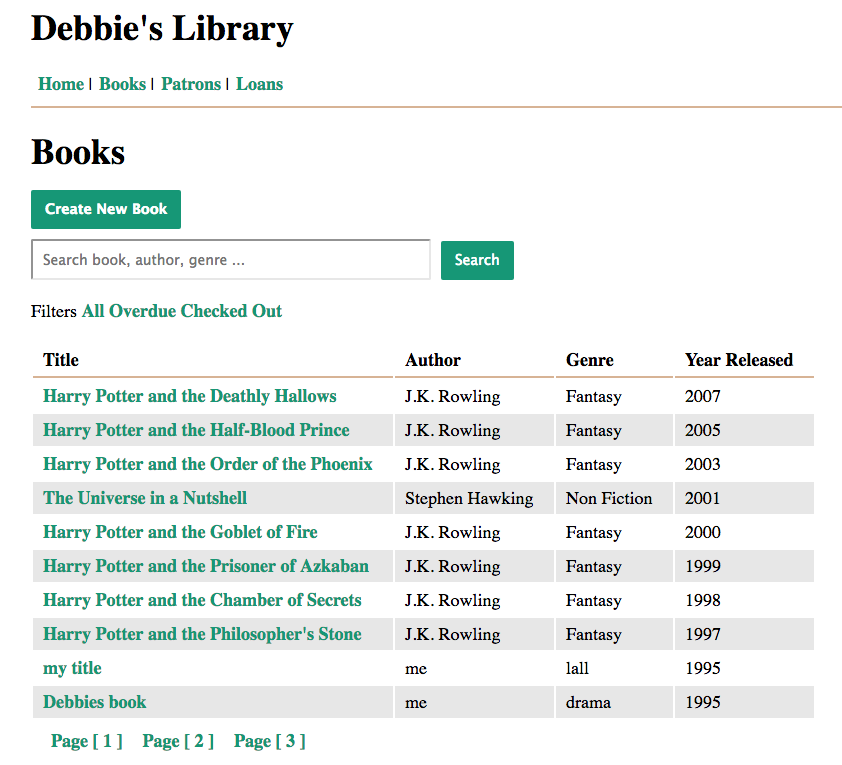

# Build a Library Manager
## Team Tree House FullStack Project 10
### Node, Express, Sequelize, Pug, JavaScript, CSS3


* Create a Sequelize model for a books table, a patrons table, and a loans table
* home screen so can access functionality easily with a single click
* access a main navigation menu from every page of my application
* filter books by ‘overdue’ and ‘checked out’ status on the Books Listing Page
* Add a New Book
* book’s detail page, make edits and view its loan history
* filter loans by “All”, “Overdue”, and “Checked Out”,
* check out a book so I can lend books to patrons.
* return a book so we know the current state of a book in our library
* list all patrons
* patron's detail page, make edits and view their loan history
* create new library patrons so they can use the facilities
* notified if any of the required fields in any given form have any missing data
* Include pagination for the loans and books listing pages
* Include search fields on at least one of the books or patrons listing pages

#### By Debbie O'Brien
9 October 2017


### To run the application
```npm
npm install
npm start
the app is served on port 3000
```


### Example Code
```javascript
router.get('/', function (req, res) {
    Loan.findAll().then((loan) => {
        pages = functions.getPagination(loan, pages, amountToShow);
    }).then(() => {
        Loan.findAll({
            include: [
                {model: Patron},
                {model: Book}
            ],
            limit: amountToShow,
            offset: amountToShow * (parseInt(req.query.page) - 1)
        }).then((loan) => {
            res.render('all_loans', {
                loans: loan,
                heading: 'Loans',
                currentPage: req.query.page,
                pages: pages
            });
        });
    });
});
```